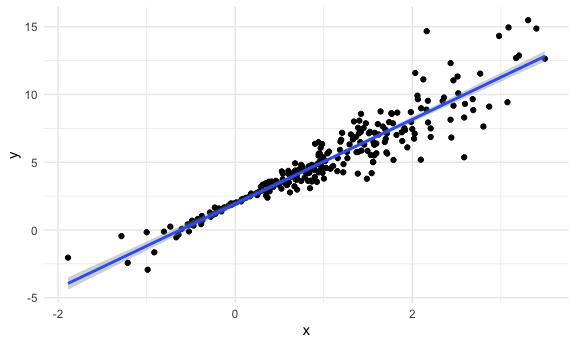
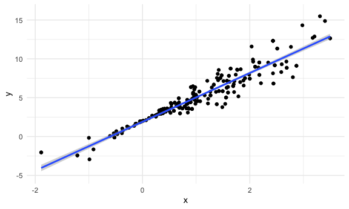
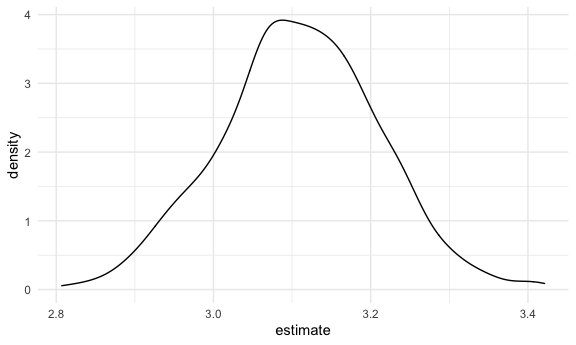

Bootstrapping
================

``` r
library(tidyverse)
```

    ## ── Attaching packages ────────────────────────────────────────────────────── tidyverse 1.3.0 ──

    ## ✓ ggplot2 3.3.2     ✓ purrr   0.3.4
    ## ✓ tibble  3.0.3     ✓ dplyr   1.0.2
    ## ✓ tidyr   1.1.2     ✓ stringr 1.4.0
    ## ✓ readr   1.3.1     ✓ forcats 0.5.0

    ## ── Conflicts ───────────────────────────────────────────────────────── tidyverse_conflicts() ──
    ## x dplyr::filter() masks stats::filter()
    ## x dplyr::lag()    masks stats::lag()

``` r
library(patchwork)
library(stringr)
library(p8105.datasets)
library(mgcv)
```

    ## Loading required package: nlme

    ## 
    ## Attaching package: 'nlme'

    ## The following object is masked from 'package:dplyr':
    ## 
    ##     collapse

    ## This is mgcv 1.8-33. For overview type 'help("mgcv-package")'.

``` r
library(modelr)
library(broom)
```

    ## 
    ## Attaching package: 'broom'

    ## The following object is masked from 'package:modelr':
    ## 
    ##     bootstrap

``` r
knitr::opts_chunk$set(
  fig.width = 6,
  fig.asp = .6,
  out.width = "90%"
)
theme_set(theme_minimal() + theme(legend.position = "bottom"))
options(
  ggplot2.continuous.colour = "viridis",
  ggplot2.continuous.fill = "viridis"
)
scale_colour_discrete = scale_colour_viridis_d
scale_fill_discrete = scale_fill_viridis_d

set.seed(1)
```

## Simulate data

``` r
n_samp = 250

sim_df_const = 
  tibble(
    x = rnorm(n_samp, 1, 1),
    error = rnorm(n_samp, 0, 1),
    y = 2 + 3 * x + error
  )

sim_df_nonconst = 
  sim_df_const %>% 
  mutate(
    error = error * 0.75 * x,
    y = 2 + 3 * x + error
  )
```

Plot datasets

``` r
sim_df_const %>% 
  ggplot(aes(x = x, y = y)) + 
  geom_point() + 
  geom_smooth(method = "lm")
```

    ## `geom_smooth()` using formula 'y ~ x'


``` r
sim_df_nonconst %>% 
  ggplot(aes(x = x, y = y)) + 
  geom_point() + 
  geom_smooth(method = "lm")
```

    ## `geom_smooth()` using formula 'y ~ x'



Can see that the second line fits less well b/c error terms are not
constant. The error terms in second model vary as a result of X (the
predictor variable)

Assumption for linear regression won’t fit for sim\_df\_nonconst. Can
still fit OLS regression, but its hard to know how wide confidence
interval should be when look at these estimates.

Fit LM for each of these as if OLS assumptions are true.

``` r
lm(y ~ x, data = sim_df_const) %>% broom::tidy()
```

    ## # A tibble: 2 x 5
    ##   term        estimate std.error statistic   p.value
    ##   <chr>          <dbl>     <dbl>     <dbl>     <dbl>
    ## 1 (Intercept)     1.98    0.0981      20.2 3.65e- 54
    ## 2 x               3.04    0.0699      43.5 3.84e-118

``` r
lm(y ~ x, data = sim_df_nonconst) %>% broom::tidy()
```

    ## # A tibble: 2 x 5
    ##   term        estimate std.error statistic   p.value
    ##   <chr>          <dbl>     <dbl>     <dbl>     <dbl>
    ## 1 (Intercept)     1.93    0.105       18.5 1.88e- 48
    ## 2 x               3.11    0.0747      41.7 5.76e-114

## Use bootstrap

We know usual OLS assumptions aren’t met in this dataset. So let’s
understand distribution of intercept and slope of repeated samples of
datasets. Problem isn’t the estimate, it’s the confidence intervals.

sample frac draws a sample from df, default is drawing sample as same
size as original df. want sample to be same size b/c CI and variance
estimates are very dependent on sample size. So need to keep sample size
fixed in bootstrapping.

Draw sample size with replacement so don’t get exactly the same sample
each time. Mimics collecting new data\!

``` r
boot_sample = function(df) {
  
  sample_frac(df, replace = TRUE) %>% 
    arrange(x)
  
}
```

Check function

``` r
boot_sample(sim_df_nonconst)
```

    ## # A tibble: 250 x 3
    ##         x  error       y
    ##     <dbl>  <dbl>   <dbl>
    ##  1 -1.89   1.62  -2.04  
    ##  2 -1.29   1.40  -0.454 
    ##  3 -0.989 -1.97  -2.93  
    ##  4 -0.989 -1.97  -2.93  
    ##  5 -0.914 -0.908 -1.65  
    ##  6 -0.914 -0.908 -1.65  
    ##  7 -0.914 -0.908 -1.65  
    ##  8 -0.733  0.447  0.248 
    ##  9 -0.733  0.447  0.248 
    ## 10 -0.606 -0.106  0.0774
    ## # … with 240 more rows

Each time you run function, get different sample. It’ll draw some values
from original sample multiple times, some none at all. Assumes original
sample is sufficiently large to be representative of population.

``` r
boot_sample(sim_df_nonconst) %>% 
  ggplot(aes(x = x, y = y)) + 
  geom_point() + 
  geom_smooth(method = "lm") + 
  ylim(-5, 16)
```

    ## `geom_smooth()` using formula 'y ~ x'



Line moves every time run it\!

Can we estimate slope and intercept and save across bootstrapped
samples.

``` r
boot_sample(sim_df_nonconst) %>% 
  lm(y ~ x, data = .) %>% 
  broom::tidy()
```

    ## # A tibble: 2 x 5
    ##   term        estimate std.error statistic   p.value
    ##   <chr>          <dbl>     <dbl>     <dbl>     <dbl>
    ## 1 (Intercept)     1.89    0.118       16.0 4.78e- 40
    ## 2 x               3.12    0.0843      37.0 5.32e-103

Every time we run this, will be slightly different.

## Many samples and analyses

``` r
boot_straps = 
  tibble(
    strap_number = 1:1000,
    strap_sample = rerun(1000, boot_sample(sim_df_nonconst))
  )

boot_straps %>% pull(strap_sample) %>% .[[1]]
```

    ## # A tibble: 250 x 3
    ##         x  error      y
    ##     <dbl>  <dbl>  <dbl>
    ##  1 -1.89   1.62  -2.04 
    ##  2 -1.89   1.62  -2.04 
    ##  3 -1.29   1.40  -0.454
    ##  4 -1.29   1.40  -0.454
    ##  5 -1.00   0.832 -0.169
    ##  6 -0.914 -0.908 -1.65 
    ##  7 -0.805  0.292 -0.123
    ##  8 -0.665 -0.544 -0.539
    ##  9 -0.665 -0.544 -0.539
    ## 10 -0.665 -0.544 -0.539
    ## # … with 240 more rows

Now can use same iterative analyses we used in other places\!

Fit regression to each boot strapped df and get some results

``` r
boot_results =
  boot_straps %>%
  mutate(
    models = map(.x = strap_sample, ~lm(y ~ x, data = .x)),
    results = map(models, broom::tidy)
  ) %>% 
  select(strap_number, results) %>% 
  unnest(results)
```

This df has 1000 datasets, and for each dataset, fit linear regression
and got intercept and slope for each.

For each dataset, we don’t care about std.error, statistic, p.value.

We care about distribution of estimated intercept and slope. We *hope*
that these distributions are similar to the standard error.

What is actual std deviation of estimates under repeated sampling?

``` r
boot_results %>% 
  group_by(term) %>%
  summarize(
    mean_est = mean(estimate),
    sd_est = sd(estimate)
  )
```

    ## `summarise()` ungrouping output (override with `.groups` argument)

    ## # A tibble: 2 x 3
    ##   term        mean_est sd_est
    ##   <chr>          <dbl>  <dbl>
    ## 1 (Intercept)     1.93 0.0748
    ## 2 x               3.11 0.101

We know linear regression will assume constant variance, and we know
constant variance isn’t the right assumption….

So, we want to know what the *actual* uncertainty (standard error) is in
the intercept and parameter. Not assuming constant (residual) variance
here, looking for actual uncertainty in intercept and slope.

If you compare bootstrap sd of intercept

## Confidence intervals

First, look at distributions of bootstrapped results

``` r
boot_results %>% 
  filter(term == "x") %>% 
  ggplot(aes(x = estimate)) + 
  geom_density()
```



HEY THIS IS COOL\! Under repeated sampling, the actual distribution of
the slope estimate in my sample does look like a normal distribution.
This doesn’t rely on any OLS assumptions.

Construct bootstrap CI

``` r
boot_results %>%
  group_by(term) %>% 
  summarize(
    ci_lower = quantile(estimate, 0.025),
    ci_upper = quantile(estimate, 0.975)
  )
```

    ## `summarise()` ungrouping output (override with `.groups` argument)

    ## # A tibble: 2 x 3
    ##   term        ci_lower ci_upper
    ##   <chr>          <dbl>    <dbl>
    ## 1 (Intercept)     1.79     2.08
    ## 2 x               2.91     3.31

## Bootstrap using modelr

Can we simplify anything…?

``` r
sim_df_nonconst %>% 
  modelr::bootstrap(1000)
```

    ## # A tibble: 1,000 x 2
    ##    strap      .id  
    ##    <list>     <chr>
    ##  1 <resample> 0001 
    ##  2 <resample> 0002 
    ##  3 <resample> 0003 
    ##  4 <resample> 0004 
    ##  5 <resample> 0005 
    ##  6 <resample> 0006 
    ##  7 <resample> 0007 
    ##  8 <resample> 0008 
    ##  9 <resample> 0009 
    ## 10 <resample> 0010 
    ## # … with 990 more rows

The modelr package bootstrap function is just like manual function I
wrote above.

mgcv::gam package doesn’t work well with this

``` r
## Map a linear model for each of 1000 bootstrap samples
sim_df_nonconst %>% 
  modelr::bootstrap(1000, id = "strap_number") %>% 
  mutate(
    models = map(.x = strap, ~lm(y ~ x, data = .x)),
    results = map(models, broom::tidy)
  ) %>% 
  select(strap_number, results) %>% 
  unnest(results)
```

    ## # A tibble: 2,000 x 6
    ##    strap_number term        estimate std.error statistic   p.value
    ##    <chr>        <chr>          <dbl>     <dbl>     <dbl>     <dbl>
    ##  1 0001         (Intercept)     1.90    0.104       18.2 1.07e- 47
    ##  2 0001         x               3.09    0.0756      40.9 3.22e-112
    ##  3 0002         (Intercept)     2.01    0.114       17.6 2.16e- 45
    ##  4 0002         x               3.15    0.0760      41.5 1.15e-113
    ##  5 0003         (Intercept)     1.89    0.113       16.8 7.93e- 43
    ##  6 0003         x               3.30    0.0765      43.1 3.07e-117
    ##  7 0004         (Intercept)     2.00    0.102       19.7 1.52e- 52
    ##  8 0004         x               3.03    0.0715      42.4 1.40e-115
    ##  9 0005         (Intercept)     1.90    0.100       19.0 2.85e- 50
    ## 10 0005         x               3.08    0.0702      43.9 6.83e-119
    ## # … with 1,990 more rows

``` r
## Calculate the mean of the bootstrap sample lm parameters
sim_df_nonconst %>% 
  modelr::bootstrap(1000, id = "strap_number") %>% 
  mutate(
    models = map(.x = strap, ~lm(y ~ x, data = .x)),
    results = map(models, broom::tidy)
  ) %>% 
  select(strap_number, results) %>% 
  unnest(results) %>% 
  group_by(term) %>% 
  summarize(
    mean_est = mean(estimate),
    sd_est = sd(estimate)
  )
```

    ## `summarise()` ungrouping output (override with `.groups` argument)

    ## # A tibble: 2 x 3
    ##   term        mean_est sd_est
    ##   <chr>          <dbl>  <dbl>
    ## 1 (Intercept)     1.93 0.0764
    ## 2 x               3.11 0.104

We were able to get this pretty quickly\! This is the actual mean and sd
of the parameter estimate on parameter samples. The estimates and
standard errors are also pretty close to what they should be if OLS
fits.
