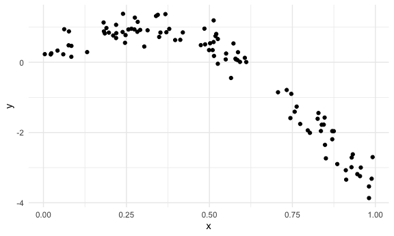
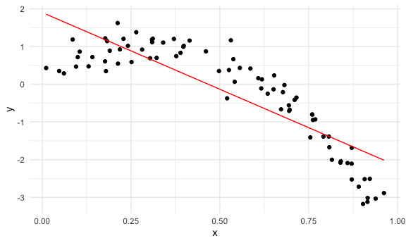
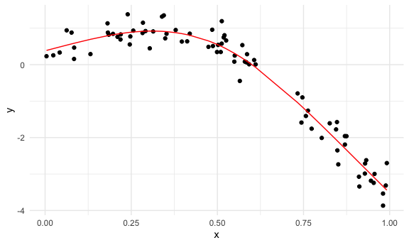
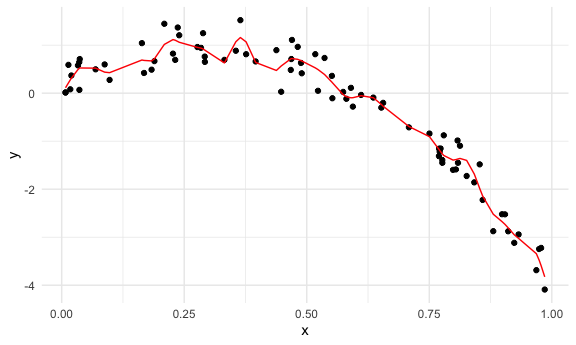
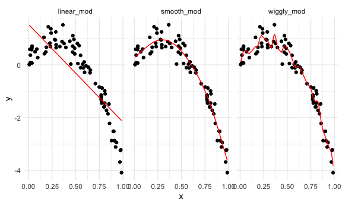
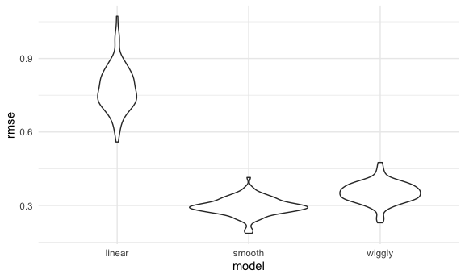

Cross Validation
================

``` r
library(tidyverse)
```

    ## ── Attaching packages ────────────────────────────────────────────────────── tidyverse 1.3.0 ──

    ## ✓ ggplot2 3.3.2     ✓ purrr   0.3.4
    ## ✓ tibble  3.0.3     ✓ dplyr   1.0.2
    ## ✓ tidyr   1.1.2     ✓ stringr 1.4.0
    ## ✓ readr   1.3.1     ✓ forcats 0.5.0

    ## ── Conflicts ───────────────────────────────────────────────────────── tidyverse_conflicts() ──
    ## x dplyr::filter() masks stats::filter()
    ## x dplyr::lag()    masks stats::lag()

``` r
library(patchwork)
library(stringr)
library(p8105.datasets)
library(mgcv)
```

    ## Loading required package: nlme

    ## 
    ## Attaching package: 'nlme'

    ## The following object is masked from 'package:dplyr':
    ## 
    ##     collapse

    ## This is mgcv 1.8-33. For overview type 'help("mgcv-package")'.

``` r
library(modelr)
library(broom)
```

    ## 
    ## Attaching package: 'broom'

    ## The following object is masked from 'package:modelr':
    ## 
    ##     bootstrap

``` r
knitr::opts_chunk$set(
  fig.width = 6,
  fig.asp = .6,
  out.width = "90%"
)
theme_set(theme_minimal() + theme(legend.position = "bottom"))
options(
  ggplot2.continuous.colour = "viridis",
  ggplot2.continuous.fill = "viridis"
)
scale_colour_discrete = scale_colour_viridis_d
scale_fill_discrete = scale_fill_viridis_d
```

What to get out of this:

1)  How to use prediction accuracy to compare models of varying degrees
    of complexity using cross-validation

2)  Need to build models of varying degrees of complexity using various
    tools. Less important to understand specific tools.

## Simulate data

Identify how to choose right model

``` r
nonlin_df =
  tibble(
    id = 1:100,
    x = runif(100, 0, 1),
    y = 1 - 10 * (x - 0.3) ^ 2 + rnorm(100, 0, 0.3)
  )
```

Look at data

``` r
nonlin_df %>% 
  ggplot(aes(x = x, y = y)) + 
  geom_point()
```



## Cross validation – by hand

Get training and testing datasets

``` r
train_df = sample_n(nonlin_df, size = 80)
test_df = anti_join(nonlin_df, train_df, by = "id")
```

This creates two df’s that do not overlap. Samples train 80/100, and
then test for the remaining 20

Fit three models.

``` r
linear_mod = lm(y ~ x, data = train_df)
smooth_mod = mgcv::gam(y ~ s(x), data = train_df)
wiggly_mod = mgcv::gam(y ~ s(x, k = 30), sp = 10e-6, data = train_df)
```

Can I see what I just did

``` r
train_df %>% 
  add_predictions(linear_mod) %>% 
  ggplot(aes(x = x, y = y)) + 
  geom_point() + 
  geom_line(aes(y = pred), color = "red")
```



``` r
train_df %>% 
  add_predictions(smooth_mod) %>% 
  ggplot(aes(x = x, y = y)) + 
  geom_point() + 
  geom_line(aes(y = pred), color = "red")
```



``` r
train_df %>% 
  add_predictions(wiggly_mod) %>% 
  ggplot(aes(x = x, y = y)) + 
  geom_point() + 
  geom_line(aes(y = pred), color = "red")
```



``` r
train_df %>% 
  gather_predictions(linear_mod, smooth_mod, wiggly_mod) %>% 
  ggplot(aes(x = x, y = y)) + 
  geom_point() + 
  geom_line(aes(y = pred), color = "red") + 
  facet_grid(. ~ model)
```



Smooth model probably should do best.

gather\_predictions to look at multiple models at once

Look at prediction accuracy: look at root mean square error using the
linear model on TESTING dataset

``` r
rmse(linear_mod, test_df)
```

    ## [1] 0.6687464

``` r
rmse(smooth_mod, test_df)
```

    ## [1] 0.2788097

``` r
rmse(wiggly_mod, test_df)
```

    ## [1] 0.3152495

We want the lowest RMSE.

## Cross validation using `modelr`

Automates generation of testing and training df

``` r
cv_df = 
  crossv_mc(nonlin_df, 100)
```

What is happening here…

Resampling objects: draws from sample repeatedly in random way

``` r
cv_df %>% pull(train) %>% .[[1]] %>% as_tibble()
```

    ## # A tibble: 79 x 3
    ##       id      x       y
    ##    <int>  <dbl>   <dbl>
    ##  1     1 0.551   0.360 
    ##  2     2 0.804  -1.59  
    ##  3     3 0.365   0.432 
    ##  4     4 0.482   0.965 
    ##  5     6 0.760  -1.47  
    ##  6     7 0.523   0.0497
    ##  7     8 0.284   0.944 
    ##  8     9 0.378   0.949 
    ##  9    10 0.904  -2.52  
    ## 10    11 0.0332  0.578 
    ## # … with 69 more rows

``` r
cv_df %>% pull(test) %>% .[[1]] %>% as_tibble()
```

    ## # A tibble: 21 x 3
    ##       id      x       y
    ##    <int>  <dbl>   <dbl>
    ##  1     5 0.0175  0.0809
    ##  2    12 0.240   1.21  
    ##  3    18 0.771  -1.22  
    ##  4    24 0.183   0.489 
    ##  5    26 0.656  -0.202 
    ##  6    28 0.470   1.11  
    ##  7    32 0.708  -0.711 
    ##  8    33 0.773  -1.15  
    ##  9    34 0.469   0.711 
    ## 10    41 0.288   1.25  
    ## # … with 11 more rows

Can convert each df back into its own tibble as above

Let’s get list columns of df, not resample objects

``` r
cv_df = 
  cv_df %>% 
  mutate(train = map(train, as_tibble),
         test = map(test, as_tibble))
```

Let’s try to fit models and get RMSEs for each of these.

``` r
cv_df = 
  cv_df %>% 
  mutate(
    linear_mod = map(.x = train, ~lm(y ~ x, data = .x)),
    smooth_mod = map(.x = train, ~gam(y ~ s(x), data = .x)),
    wiggly_mod = map(.x = train, ~gam(y ~ s(x, k = 30), sp = 10e-6, data = .x))
  ) %>% 
  mutate(
    rmse_linear = map2_dbl(.x = linear_mod, .y = test, ~rmse(model = .x, data = .y)),
    rmse_smooth = map2_dbl(.x = smooth_mod, .y = test, ~rmse(model = .x, data = .y)),
    rmse_wiggly = map2_dbl(.x = wiggly_mod, .y = test, ~rmse(model = .x, data = .y))
  )
```

What do these results say about model choices?

``` r
cv_df %>% 
  select(starts_with("rmse")) %>% 
  pivot_longer(
    everything(),
    names_to = "model",
    values_to = "rmse",
    names_prefix = "rmse_"
  )
```

    ## # A tibble: 300 x 2
    ##    model   rmse
    ##    <chr>  <dbl>
    ##  1 linear 0.834
    ##  2 smooth 0.241
    ##  3 wiggly 0.253
    ##  4 linear 0.702
    ##  5 smooth 0.278
    ##  6 wiggly 0.353
    ##  7 linear 0.746
    ##  8 smooth 0.263
    ##  9 wiggly 0.311
    ## 10 linear 0.727
    ## # … with 290 more rows

``` r
##plot this

cv_df %>% 
  select(starts_with("rmse")) %>% 
  pivot_longer(
    everything(),
    names_to = "model",
    values_to = "rmse",
    names_prefix = "rmse_"
  ) %>% 
  ggplot(aes(x = model, y = rmse)) + 
  geom_violin()
```



Cool\! Linear model does poorly. Among the 3 models, the smooth model
does the best.

Compute averages

``` r
cv_df %>% 
  select(starts_with("rmse")) %>% 
  pivot_longer(
    everything(),
    names_to = "model",
    values_to = "rmse",
    names_prefix = "rmse_"
  ) %>% 
  group_by(model) %>% 
  summarize(avg_rmse = mean(rmse))
```

    ## `summarise()` ungrouping output (override with `.groups` argument)

    ## # A tibble: 3 x 2
    ##   model  avg_rmse
    ##   <chr>     <dbl>
    ## 1 linear    0.778
    ## 2 smooth    0.296
    ## 3 wiggly    0.352
