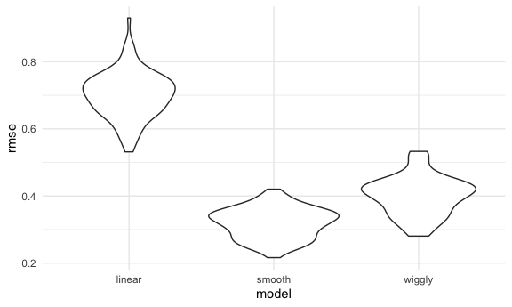
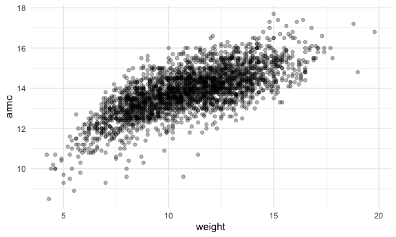
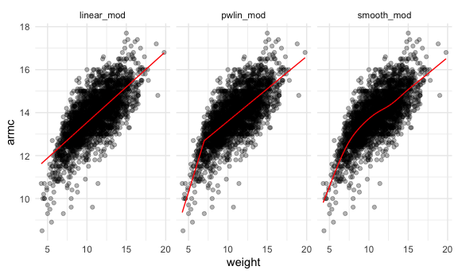
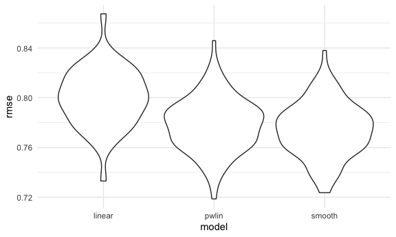

Cross Validation
================

``` r
library(tidyverse)
```

    ## ── Attaching packages ────────────────────────────────────────────────────── tidyverse 1.3.0 ──

    ## ✓ ggplot2 3.3.2     ✓ purrr   0.3.4
    ## ✓ tibble  3.0.3     ✓ dplyr   1.0.2
    ## ✓ tidyr   1.1.2     ✓ stringr 1.4.0
    ## ✓ readr   1.3.1     ✓ forcats 0.5.0

    ## ── Conflicts ───────────────────────────────────────────────────────── tidyverse_conflicts() ──
    ## x dplyr::filter() masks stats::filter()
    ## x dplyr::lag()    masks stats::lag()

``` r
library(patchwork)
library(stringr)
library(p8105.datasets)
library(mgcv)
```

    ## Loading required package: nlme

    ## 
    ## Attaching package: 'nlme'

    ## The following object is masked from 'package:dplyr':
    ## 
    ##     collapse

    ## This is mgcv 1.8-33. For overview type 'help("mgcv-package")'.

``` r
library(modelr)
library(broom)
```

    ## 
    ## Attaching package: 'broom'

    ## The following object is masked from 'package:modelr':
    ## 
    ##     bootstrap

``` r
knitr::opts_chunk$set(
  fig.width = 6,
  fig.asp = .6,
  out.width = "90%"
)
theme_set(theme_minimal() + theme(legend.position = "bottom"))
options(
  ggplot2.continuous.colour = "viridis",
  ggplot2.continuous.fill = "viridis"
)
scale_colour_discrete = scale_colour_viridis_d
scale_fill_discrete = scale_fill_viridis_d
```

What to get out of this:

1)  How to use prediction accuracy to compare models of varying degrees
    of complexity using cross-validation

2)  Need to build models of varying degrees of complexity using various
    tools. Less important to understand specific tools.

## Simulate data

Identify how to choose right model

``` r
nonlin_df =
  tibble(
    id = 1:100,
    x = runif(100, 0, 1),
    y = 1 - 10 * (x - 0.3) ^ 2 + rnorm(100, 0, 0.3)
  )
```

Look at data

``` r
nonlin_df %>% 
  ggplot(aes(x = x, y = y)) + 
  geom_point()
```


## Cross validation – by hand

Get training and testing datasets

``` r
train_df = sample_n(nonlin_df, size = 80)
test_df = anti_join(nonlin_df, train_df, by = "id")
```

This creates two df’s that do not overlap. Samples train 80/100, and
then test for the remaining 20

Fit three models.

``` r
linear_mod = lm(y ~ x, data = train_df)
smooth_mod = mgcv::gam(y ~ s(x), data = train_df)
wiggly_mod = mgcv::gam(y ~ s(x, k = 30), sp = 10e-6, data = train_df)
```

Can I see what I just did

``` r
train_df %>% 
  add_predictions(linear_mod) %>% 
  ggplot(aes(x = x, y = y)) + 
  geom_point() + 
  geom_line(aes(y = pred), color = "red")
```


``` r
train_df %>% 
  add_predictions(smooth_mod) %>% 
  ggplot(aes(x = x, y = y)) + 
  geom_point() + 
  geom_line(aes(y = pred), color = "red")
```


``` r
train_df %>% 
  add_predictions(wiggly_mod) %>% 
  ggplot(aes(x = x, y = y)) + 
  geom_point() + 
  geom_line(aes(y = pred), color = "red")
```


``` r
train_df %>% 
  gather_predictions(linear_mod, smooth_mod, wiggly_mod) %>% 
  ggplot(aes(x = x, y = y)) + 
  geom_point() + 
  geom_line(aes(y = pred), color = "red") + 
  facet_grid(. ~ model)
```


Smooth model probably should do best.

gather\_predictions to look at multiple models at once

Look at prediction accuracy: look at root mean square error using the
linear model on TESTING dataset

``` r
rmse(linear_mod, test_df)
```

    ## [1] 0.6756884

``` r
rmse(smooth_mod, test_df)
```

    ## [1] 0.3589506

``` r
rmse(wiggly_mod, test_df)
```

    ## [1] 0.4175184

We want the lowest RMSE.

## Cross validation using `modelr`

Automates generation of testing and training df

``` r
cv_df = 
  crossv_mc(nonlin_df, 100)
```

What is happening here…

Resampling objects: draws from sample repeatedly in random way

``` r
cv_df %>% pull(train) %>% .[[1]] %>% as_tibble()
```

    ## # A tibble: 79 x 3
    ##       id     x      y
    ##    <int> <dbl>  <dbl>
    ##  1     1 0.586  0.416
    ##  2     2 0.398  0.993
    ##  3     3 0.938 -3.03 
    ##  4     4 0.841 -2.04 
    ##  5     5 0.371  1.20 
    ##  6     7 0.908 -2.51 
    ##  7     9 0.389  0.833
    ##  8    10 0.461  0.872
    ##  9    12 0.141  0.720
    ## 10    13 0.304  0.689
    ## # … with 69 more rows

``` r
cv_df %>% pull(test) %>% .[[1]] %>% as_tibble()
```

    ## # A tibble: 21 x 3
    ##       id     x      y
    ##    <int> <dbl>  <dbl>
    ##  1     6 0.131  0.473
    ##  2     8 0.265  1.38 
    ##  3    11 0.521 -0.373
    ##  4    15 0.678 -0.210
    ##  5    28 0.531  1.16 
    ##  6    29 0.672 -0.664
    ##  7    42 0.322  0.699
    ##  8    51 0.922 -2.51 
    ##  9    52 0.357  0.593
    ## 10    58 0.212  1.62 
    ## # … with 11 more rows

Can convert each df back into its own tibble as above

Let’s get list columns of df, not resample objects

``` r
cv_df = 
  cv_df %>% 
  mutate(train = map(train, as_tibble),
         test = map(test, as_tibble))
```

Let’s try to fit models and get RMSEs for each of these.

``` r
cv_df = 
  cv_df %>% 
  mutate(
    linear_mod = map(.x = train, ~lm(y ~ x, data = .x)),
    smooth_mod = map(.x = train, ~gam(y ~ s(x), data = .x)),
    wiggly_mod = map(.x = train, ~gam(y ~ s(x, k = 30), sp = 10e-6, data = .x))
  ) %>% 
  mutate(
    rmse_linear = map2_dbl(.x = linear_mod, .y = test, ~rmse(model = .x, data = .y)),
    rmse_smooth = map2_dbl(.x = smooth_mod, .y = test, ~rmse(model = .x, data = .y)),
    rmse_wiggly = map2_dbl(.x = wiggly_mod, .y = test, ~rmse(model = .x, data = .y))
  )
```

What do these results say about model choices?

``` r
cv_df %>% 
  select(starts_with("rmse")) %>% 
  pivot_longer(
    everything(),
    names_to = "model",
    values_to = "rmse",
    names_prefix = "rmse_"
  )
```

    ## # A tibble: 300 x 2
    ##    model   rmse
    ##    <chr>  <dbl>
    ##  1 linear 0.722
    ##  2 smooth 0.386
    ##  3 wiggly 0.436
    ##  4 linear 0.645
    ##  5 smooth 0.299
    ##  6 wiggly 0.404
    ##  7 linear 0.772
    ##  8 smooth 0.342
    ##  9 wiggly 0.451
    ## 10 linear 0.765
    ## # … with 290 more rows

``` r
##plot this

cv_df %>% 
  select(starts_with("rmse")) %>% 
  pivot_longer(
    everything(),
    names_to = "model",
    values_to = "rmse",
    names_prefix = "rmse_"
  ) %>% 
  ggplot(aes(x = model, y = rmse)) + 
  geom_violin()
```



Cool\! Linear model does poorly. Among the 3 models, the smooth model
does the best.

Compute averages

``` r
cv_df %>% 
  select(starts_with("rmse")) %>% 
  pivot_longer(
    everything(),
    names_to = "model",
    values_to = "rmse",
    names_prefix = "rmse_"
  ) %>% 
  group_by(model) %>% 
  summarize(avg_rmse = mean(rmse))
```

    ## `summarise()` ungrouping output (override with `.groups` argument)

    ## # A tibble: 3 x 2
    ##   model  avg_rmse
    ##   <chr>     <dbl>
    ## 1 linear    0.701
    ## 2 smooth    0.319
    ## 3 wiggly    0.401

## Try on a real dataset

``` r
child_growth_df = 
  read_csv("./data/nepalese_children.csv") %>% 
  mutate(
    weight_cp = (weight > 7) * (weight - 7)
  )
```

    ## Parsed with column specification:
    ## cols(
    ##   age = col_double(),
    ##   sex = col_double(),
    ##   weight = col_double(),
    ##   height = col_double(),
    ##   armc = col_double()
    ## )

How well does weight predict arm circumference

``` r
child_growth_df %>% 
  ggplot(aes(x = weight, y = armc)) + 
  geom_point(alpha = 0.3)
```



Make a change point model, adding weight\_cp above

### Fit models I care about

``` r
linear_mod = lm(armc ~ weight, data = child_growth_df)
pwlin_mod = lm(armc ~ weight + weight_cp, data = child_growth_df)
smooth_mod = gam(armc ~ s(weight), data = child_growth_df)
```

``` r
child_growth_df %>% 
  gather_predictions(linear_mod, pwlin_mod, smooth_mod) %>% 
  ggplot(aes(x = weight, y = armc)) + 
  geom_point(alpha = 0.3) + 
  geom_line(aes(y = pred), color = "red") + 
  facet_grid(. ~ model)
```



### Cross-validation

Try to understand how well each model fits

``` r
cv_df = 
  crossv_mc(child_growth_df, 100) %>% 
  mutate(
    train = map(train, as_tibble),
    test = map(test, as_tibble)
  )
```

See if can fit model to the splits

``` r
cv_df = 
  cv_df %>% 
  mutate(
    linear_mod = map(.x = train, ~lm(armc ~ weight, data = .x)),
    smooth_mod = map(.x = train, ~gam(armc ~ s(weight), data = .x)),
    pwlin_mod = map(.x = train, ~gam(armc ~ weight + weight_cp, data = .x))
  ) %>% 
  mutate(
    rmse_linear = map2_dbl(.x = linear_mod, .y = test, ~rmse(model = .x, data = .y)),
    rmse_smooth = map2_dbl(.x = smooth_mod, .y = test, ~rmse(model = .x, data = .y)),
    rmse_pwlin = map2_dbl(.x = pwlin_mod, .y = test, ~rmse(model = .x, data = .y))
  )
```

Violin plot of RMSEs

``` r
cv_df %>% 
  select(starts_with("rmse")) %>% 
  pivot_longer(
    everything(),
    names_to = "model",
    values_to = "rmse",
    names_prefix = "rmse_"
  ) %>% 
  ggplot(aes(x = model, y = rmse)) + 
  geom_violin()
```



Consider picking the piecewise linear model (pwlin) bc there’s clear
improvement from linear to pwlin and not huge improvement to smooth
model. Interpretation of piecewise linear model is more easily
interpretable.
