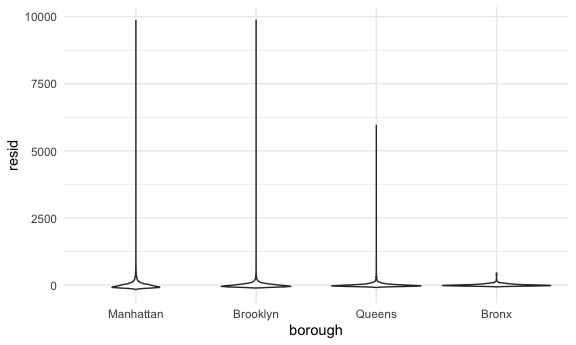
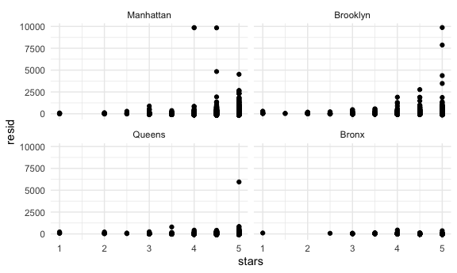
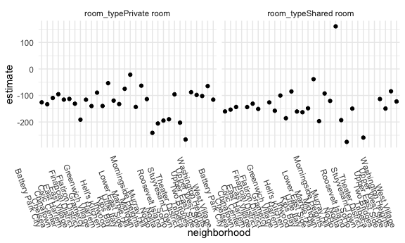

Linear Models
================
11/26/2020

``` r
library(tidyverse)
```

    ## ── Attaching packages ────────────────────────────────────────────────────── tidyverse 1.3.0 ──

    ## ✓ ggplot2 3.3.2     ✓ purrr   0.3.4
    ## ✓ tibble  3.0.3     ✓ dplyr   1.0.2
    ## ✓ tidyr   1.1.2     ✓ stringr 1.4.0
    ## ✓ readr   1.3.1     ✓ forcats 0.5.0

    ## ── Conflicts ───────────────────────────────────────────────────────── tidyverse_conflicts() ──
    ## x dplyr::filter() masks stats::filter()
    ## x dplyr::lag()    masks stats::lag()

``` r
library(patchwork)
library(stringr)
library(p8105.datasets)


knitr::opts_chunk$set(
  fig.width = 6,
  fig.asp = .6,
  out.width = "90%"
)
theme_set(theme_minimal() + theme(legend.position = "bottom"))
options(
  ggplot2.continuous.colour = "viridis",
  ggplot2.continuous.fill = "viridis"
)
scale_colour_discrete = scale_colour_viridis_d
scale_fill_discrete = scale_fill_viridis_d
```

## Data import and tidying

``` r
data("nyc_airbnb")

nyc_airbnb = 
  nyc_airbnb %>% 
  mutate(stars = review_scores_location / 2) %>% 
  rename(
    borough = neighbourhood_group,
    neighborhood = neighbourhood
  ) %>% 
  filter(borough != "Staten Island") %>% 
  select(price, stars, borough, neighborhood, room_type)
```

## Fit a model

Want to know how price of rental is related to stars and borough

``` r
nyc_airbnb %>% 
  ggplot(aes(x = stars, y = price, color = borough)) + 
  geom_point()
```

    ## Warning: Removed 9962 rows containing missing values (geom_point).


Want to fit a model to this

``` r
price_fit = lm(price ~ stars + borough, data = nyc_airbnb)
```

Lets look at model results generically

``` r
price_fit
```

    ## 
    ## Call:
    ## lm(formula = price ~ stars + borough, data = nyc_airbnb)
    ## 
    ## Coefficients:
    ##      (Intercept)             stars   boroughBrooklyn  boroughManhattan  
    ##           -70.41             31.99             40.50             90.25  
    ##    boroughQueens  
    ##            13.21

``` r
#This gives a fair bit of info
summary(price_fit)
```

    ## 
    ## Call:
    ## lm(formula = price ~ stars + borough, data = nyc_airbnb)
    ## 
    ## Residuals:
    ##    Min     1Q Median     3Q    Max 
    ## -169.8  -64.0  -29.0   20.2 9870.0 
    ## 
    ## Coefficients:
    ##                  Estimate Std. Error t value Pr(>|t|)    
    ## (Intercept)       -70.414     14.021  -5.022 5.14e-07 ***
    ## stars              31.990      2.527  12.657  < 2e-16 ***
    ## boroughBrooklyn    40.500      8.559   4.732 2.23e-06 ***
    ## boroughManhattan   90.254      8.567  10.534  < 2e-16 ***
    ## boroughQueens      13.206      9.065   1.457    0.145    
    ## ---
    ## Signif. codes:  0 '***' 0.001 '**' 0.01 '*' 0.05 '.' 0.1 ' ' 1
    ## 
    ## Residual standard error: 181.5 on 30525 degrees of freedom
    ##   (9962 observations deleted due to missingness)
    ## Multiple R-squared:  0.03423,    Adjusted R-squared:  0.03411 
    ## F-statistic: 270.5 on 4 and 30525 DF,  p-value: < 2.2e-16

``` r
#This one give t statistic and p-value for each individual coefficient
summary(price_fit)$coef
```

    ##                   Estimate Std. Error   t value     Pr(>|t|)
    ## (Intercept)      -70.41446  14.020697 -5.022180 5.137589e-07
    ## stars             31.98989   2.527500 12.656733 1.269392e-36
    ## boroughBrooklyn   40.50030   8.558724  4.732049 2.232595e-06
    ## boroughManhattan  90.25393   8.567490 10.534465 6.638618e-26
    ## boroughQueens     13.20617   9.064879  1.456850 1.451682e-01

Tidy results of fit

``` r
broom::glance(price_fit)
```

    ## # A tibble: 1 x 12
    ##   r.squared adj.r.squared sigma statistic   p.value    df  logLik    AIC    BIC
    ##       <dbl>         <dbl> <dbl>     <dbl>     <dbl> <dbl>   <dbl>  <dbl>  <dbl>
    ## 1    0.0342        0.0341  182.      271. 6.73e-229     4 -2.02e5 4.04e5 4.04e5
    ## # … with 3 more variables: deviance <dbl>, df.residual <int>, nobs <int>

``` r
broom::tidy(price_fit)
```

    ## # A tibble: 5 x 5
    ##   term             estimate std.error statistic  p.value
    ##   <chr>               <dbl>     <dbl>     <dbl>    <dbl>
    ## 1 (Intercept)         -70.4     14.0      -5.02 5.14e- 7
    ## 2 stars                32.0      2.53     12.7  1.27e-36
    ## 3 boroughBrooklyn      40.5      8.56      4.73 2.23e- 6
    ## 4 boroughManhattan     90.3      8.57     10.5  6.64e-26
    ## 5 boroughQueens        13.2      9.06      1.46 1.45e- 1

For every one-unit increase in stars, price of room increases by $32
keeping borough fixed. Implicitly ref group is Bronx (first
alphabetical). Room in Manhattan is $90 more than in Bronx.

Get test stat for each and p-value

Queens is not statistically significant

``` r
broom::tidy(price_fit) %>% 
  select(-std.error, -statistic) %>% 
  mutate(
    term = str_replace(term, "borough", "Borough: ")
  ) %>% 
  knitr::kable()
```

| term               |   estimate |   p.value |
| :----------------- | ---------: | --------: |
| (Intercept)        | \-70.41446 | 0.0000005 |
| stars              |   31.98989 | 0.0000000 |
| Borough: Brooklyn  |   40.50030 | 0.0000022 |
| Borough: Manhattan |   90.25393 | 0.0000000 |
| Borough: Queens    |   13.20617 | 0.1451682 |

## Be in control of factors

Character variables get converted to factor variables in R. Preserve
text, but add structure of 1, 2, 3, 4, 5, etc… to it. R makes an
assumption that it should be in alphabetical order, which then gets put
into indicator variables. First one alphabetically will be reference
group

Make ref category the most common one.

``` r
nyc_airbnb =
  nyc_airbnb %>% 
  mutate(
    borough = fct_infreq(borough),
    room_type = fct_infreq(room_type)
  )

nyc_airbnb %>% 
  ggplot(aes(x = stars, y = price, color = borough)) + 
  geom_point()
```

    ## Warning: Removed 9962 rows containing missing values (geom_point).


``` r
price_fit = lm(price ~ stars + borough, data = nyc_airbnb)

broom::tidy(price_fit)
```

    ## # A tibble: 5 x 5
    ##   term            estimate std.error statistic   p.value
    ##   <chr>              <dbl>     <dbl>     <dbl>     <dbl>
    ## 1 (Intercept)         19.8     12.2       1.63 1.04e-  1
    ## 2 stars               32.0      2.53     12.7  1.27e- 36
    ## 3 boroughBrooklyn    -49.8      2.23    -22.3  6.32e-109
    ## 4 boroughQueens      -77.0      3.73    -20.7  2.58e- 94
    ## 5 boroughBronx       -90.3      8.57    -10.5  6.64e- 26

``` r
broom::glance(price_fit)
```

    ## # A tibble: 1 x 12
    ##   r.squared adj.r.squared sigma statistic   p.value    df  logLik    AIC    BIC
    ##       <dbl>         <dbl> <dbl>     <dbl>     <dbl> <dbl>   <dbl>  <dbl>  <dbl>
    ## 1    0.0342        0.0341  182.      271. 6.73e-229     4 -2.02e5 4.04e5 4.04e5
    ## # … with 3 more variables: deviance <dbl>, df.residual <int>, nobs <int>

Now, Brooklyn is being compared to Manhattan, Bronx to Manhattan etc.
This doesn’t change model intrinsically, just changes what you see and
how it works

## Diagnostics

``` r
modelr::add_residuals(nyc_airbnb, price_fit)
```

    ## # A tibble: 40,492 x 6
    ##    price stars borough neighborhood room_type        resid
    ##    <dbl> <dbl> <fct>   <chr>        <fct>            <dbl>
    ##  1    99   5   Bronx   City Island  Private room      9.47
    ##  2   200  NA   Bronx   City Island  Private room     NA   
    ##  3   300  NA   Bronx   City Island  Entire home/apt  NA   
    ##  4   125   5   Bronx   City Island  Entire home/apt  35.5 
    ##  5    69   5   Bronx   City Island  Private room    -20.5 
    ##  6   125   5   Bronx   City Island  Entire home/apt  35.5 
    ##  7    85   5   Bronx   City Island  Entire home/apt  -4.53
    ##  8    39   4.5 Bronx   Allerton     Private room    -34.5 
    ##  9    95   5   Bronx   Allerton     Entire home/apt   5.47
    ## 10   125   4.5 Bronx   Allerton     Entire home/apt  51.5 
    ## # … with 40,482 more rows

This looks like usual df, but shows that for each observation, e.g., the
first room is $9.47 more than expected

``` r
modelr::add_residuals(nyc_airbnb, price_fit) %>% 
  ggplot(aes(x = borough, y = resid)) + 
  geom_violin()
```

    ## Warning: Removed 9962 rows containing non-finite values (stat_ydensity).



This is a distribution of residuals… shows some significnat outliers in
the model

``` r
nyc_airbnb %>% 
  modelr::add_residuals(price_fit) %>% 
  ggplot(aes(x = borough, y = resid)) + 
  geom_violin() + 
  ylim(-500, 1500)
```

    ## Warning: Removed 9993 rows containing non-finite values (stat_ydensity).


``` r
nyc_airbnb %>% 
  modelr::add_residuals(price_fit) %>% 
  ggplot(aes(x = stars, y = resid)) + 
  geom_point() + 
  facet_wrap(. ~borough)
```

    ## Warning: Removed 9962 rows containing missing values (geom_point).



There is a problem in that there are these big outliers in residual
distribution, suggests that model may not be appropriate.

Second plot shows that there are more outliers at higher star ratings
(extremely high priced apartments) that limit how well the model works.

## Hypothesis tests

``` r
price_fit %>% 
  broom::tidy()
```

    ## # A tibble: 5 x 5
    ##   term            estimate std.error statistic   p.value
    ##   <chr>              <dbl>     <dbl>     <dbl>     <dbl>
    ## 1 (Intercept)         19.8     12.2       1.63 1.04e-  1
    ## 2 stars               32.0      2.53     12.7  1.27e- 36
    ## 3 boroughBrooklyn    -49.8      2.23    -22.3  6.32e-109
    ## 4 boroughQueens      -77.0      3.73    -20.7  2.58e- 94
    ## 5 boroughBronx       -90.3      8.57    -10.5  6.64e- 26

This does t-test by default for each coefficient.

What if we want to test the significance of `borough` all together… use
F test (ANOVA)

``` r
fit_null = lm(price ~ stars, data = nyc_airbnb)
fit_alt = lm(price ~ stars + borough, data = nyc_airbnb)

anova(fit_null, fit_alt) %>% 
  broom::tidy()
```

    ## # A tibble: 2 x 6
    ##   res.df         rss    df     sumsq statistic    p.value
    ##    <dbl>       <dbl> <dbl>     <dbl>     <dbl>      <dbl>
    ## 1  30528 1030861841.    NA       NA        NA  NA        
    ## 2  30525 1005601724.     3 25260117.      256.  7.84e-164

If do F-test first, and then do t-test after that then worry about
multiple comparisons corrections being stats problem.

## Nest data, fit models

Instead of using one line, can you make separate regressions for
categorical variables. Can use interactions. Get slope on stars and
interaction term on borough.

``` r
fit = lm(price ~ stars * borough + room_type * borough, data = nyc_airbnb)

broom::tidy(fit)
```

    ## # A tibble: 16 x 5
    ##    term                                  estimate std.error statistic  p.value
    ##    <chr>                                    <dbl>     <dbl>     <dbl>    <dbl>
    ##  1 (Intercept)                              95.7      19.2     4.99   6.13e- 7
    ##  2 stars                                    27.1       3.96    6.84   8.20e-12
    ##  3 boroughBrooklyn                         -26.1      25.1    -1.04   2.99e- 1
    ##  4 boroughQueens                            -4.12     40.7    -0.101  9.19e- 1
    ##  5 boroughBronx                             -5.63     77.8    -0.0723 9.42e- 1
    ##  6 room_typePrivate room                  -124.        3.00  -41.5    0.      
    ##  7 room_typeShared room                   -154.        8.69  -17.7    1.42e-69
    ##  8 stars:boroughBrooklyn                    -6.14      5.24   -1.17   2.41e- 1
    ##  9 stars:boroughQueens                     -17.5       8.54   -2.04   4.09e- 2
    ## 10 stars:boroughBronx                      -22.7      17.1    -1.33   1.85e- 1
    ## 11 boroughBrooklyn:room_typePrivate room    32.0       4.33    7.39   1.55e-13
    ## 12 boroughQueens:room_typePrivate room      54.9       7.46    7.37   1.81e-13
    ## 13 boroughBronx:room_typePrivate room       71.3      18.0     3.96   7.54e- 5
    ## 14 boroughBrooklyn:room_typeShared room     47.8      13.9     3.44   5.83e- 4
    ## 15 boroughQueens:room_typeShared room       58.7      17.9     3.28   1.05e- 3
    ## 16 boroughBronx:room_typeShared room        83.1      42.5     1.96   5.03e- 2

Top output is reference group of Manhattan. Ref group of room\_type is
most common (entire apartment). Dif between private room and whole
apartment is -124 for private room, and -154 for shared room.

To identify difference between private room in brooklyn: -124 + 32 is
approx 90.

Interactions: compare one fit that has interactions and one that doesn’t
have interactions to identify if adding variable to model is useful.

Stars and other boroughs are not as significant as stars in ref group.

This is more exploratory but easier to understand

``` r
nyc_airbnb %>% 
  nest(data = -borough)
```

    ## # A tibble: 4 x 2
    ##   borough   data                 
    ##   <fct>     <list>               
    ## 1 Bronx     <tibble [649 × 4]>   
    ## 2 Queens    <tibble [3,821 × 4]> 
    ## 3 Brooklyn  <tibble [16,810 × 4]>
    ## 4 Manhattan <tibble [19,212 × 4]>

Try to fit a model to each list column dataset (for each borough), using
mutate and map

``` r
nyc_airbnb %>% 
  nest(data = -borough) %>% 
  mutate(
    models = map(.x = data, ~lm(price ~ stars, data = .x)),
    results = map(models, broom::tidy)
  )
```

    ## # A tibble: 4 x 4
    ##   borough   data                  models results         
    ##   <fct>     <list>                <list> <list>          
    ## 1 Bronx     <tibble [649 × 4]>    <lm>   <tibble [2 × 5]>
    ## 2 Queens    <tibble [3,821 × 4]>  <lm>   <tibble [2 × 5]>
    ## 3 Brooklyn  <tibble [16,810 × 4]> <lm>   <tibble [2 × 5]>
    ## 4 Manhattan <tibble [19,212 × 4]> <lm>   <tibble [2 × 5]>

``` r
nyc_airbnb %>% 
  nest(data = -borough) %>% 
  mutate(
    models = map(.x = data, ~lm(price ~ stars, data = .x)),
    results = map(models, broom::tidy)
  ) %>% 
  select(-data, -models) %>% 
  unnest(results) %>% 
  filter(term == "stars")
```

    ## # A tibble: 4 x 6
    ##   borough   term  estimate std.error statistic  p.value
    ##   <fct>     <chr>    <dbl>     <dbl>     <dbl>    <dbl>
    ## 1 Bronx     stars     4.91      4.10      1.20 2.31e- 1
    ## 2 Queens    stars    15.8       5.63      2.81 5.06e- 3
    ## 3 Brooklyn  stars    28.0       3.10      9.02 2.13e-19
    ## 4 Manhattan stars    43.3       4.78      9.07 1.39e-19

In Manhattan, significant association between stars and price. Bronx has
no significant association between stars and price. Can’t say anything
about whether boroughs are significant in relation to each other.

Now add room\_type to model and clean up.

``` r
nyc_airbnb %>% 
  nest(data = -borough) %>% 
  mutate(
    models = map(.x = data, ~lm(price ~ stars + room_type, data = .x)),
    results = map(models, broom::tidy)
  ) %>% 
  select(-data, -models) %>% 
  unnest(results) %>% 
  filter(term != "(Intercept)") %>% 
  select(borough, term, estimate) %>%
  pivot_wider(
    names_from = borough,
    values_from = estimate
  )
```

    ## # A tibble: 3 x 5
    ##   term                   Bronx Queens Brooklyn Manhattan
    ##   <chr>                  <dbl>  <dbl>    <dbl>     <dbl>
    ## 1 stars                   4.45   9.65     21.0      27.1
    ## 2 room_typePrivate room -52.9  -69.3     -92.2    -124. 
    ## 3 room_typeShared room  -70.5  -95.0    -106.     -154.

Shows what the effect of stars and roomtype is in each Borough. Going
from entire apartment to private room saves $50 in Bronx and $120 in
Manhattan.

Let’s nest even more…. fit linear model for each neighborhood in
Manhattan.

``` r
nyc_airbnb %>% 
  filter(borough == "Manhattan") %>% 
  nest(data = -neighborhood)
```

    ## # A tibble: 32 x 2
    ##    neighborhood       data                
    ##    <chr>              <list>              
    ##  1 Battery Park City  <tibble [65 × 4]>   
    ##  2 Chinatown          <tibble [360 × 4]>  
    ##  3 Chelsea            <tibble [1,072 × 4]>
    ##  4 Civic Center       <tibble [42 × 4]>   
    ##  5 East Harlem        <tibble [1,048 × 4]>
    ##  6 East Village       <tibble [1,858 × 4]>
    ##  7 Financial District <tibble [391 × 4]>  
    ##  8 Flatiron District  <tibble [90 × 4]>   
    ##  9 Gramercy           <tibble [307 × 4]>  
    ## 10 Greenwich Village  <tibble [383 × 4]>  
    ## # … with 22 more rows

``` r
## For each of the 32 neighborhoods in manhattan, fit a linear model of price as related to stars and room type.

nyc_airbnb %>% 
  filter(borough == "Manhattan") %>% 
  nest(data = -neighborhood) %>% 
  mutate(
    models = map(.x = data, ~lm(price ~ stars + room_type, data = .x)),
    results = map(models, broom::tidy)
  ) %>% 
  select(-data, -models) %>% 
  unnest(results)
```

    ## # A tibble: 123 x 6
    ##    neighborhood      term                  estimate std.error statistic  p.value
    ##    <chr>             <chr>                    <dbl>     <dbl>     <dbl>    <dbl>
    ##  1 Battery Park City (Intercept)             -119.      366.     -0.324 7.48e- 1
    ##  2 Battery Park City stars                     74.0      74.2     0.997 3.27e- 1
    ##  3 Battery Park City room_typePrivate room   -126.       27.6    -4.56  8.11e- 5
    ##  4 Battery Park City room_typeShared room    -160.       56.3    -2.84  7.96e- 3
    ##  5 Chinatown         (Intercept)              337.       60.4     5.59  5.66e- 8
    ##  6 Chinatown         stars                    -27.8      13.0    -2.14  3.34e- 2
    ##  7 Chinatown         room_typePrivate room   -109.       11.5    -9.52  1.03e-18
    ##  8 Chinatown         room_typeShared room    -143.       93.2    -1.54  1.25e- 1
    ##  9 Chelsea           (Intercept)              477.      135.      3.53  4.38e- 4
    ## 10 Chelsea           stars                    -44.5      27.3    -1.63  1.04e- 1
    ## # … with 113 more rows

``` r
## Now look only at room_type

nyc_airbnb %>% 
  filter(borough == "Manhattan") %>% 
  nest(data = -neighborhood) %>% 
  mutate(
    models = map(.x = data, ~lm(price ~ stars + room_type, data = .x)),
    results = map(models, broom::tidy)
  ) %>% 
  select(-data, -models) %>% 
  unnest(results) %>% 
  filter(str_detect(term, "room_type")) %>% 
  ggplot(aes(x = neighborhood, y = estimate)) + 
  geom_point() + 
  facet_wrap(. ~term) + 
  theme(axis.text.x=element_text(angle=-70, hjust=1))
```



This is a way to fit a bunch of models, and look at coefficients

This Rmd: \* Take dataframe, fit model to it and look at results. \* For
single model, how to do diagnostics and hypothesis test. \* Then, can do
EDA by fitting of a bunch of models across a categorical variable and
can look at coefficients to see what might be the same or different
across dif categories (BUT THIS IS JUST EDA, not formal statistic
testing of whether any of these models are good. Some may be heavily
influenced by outliers and have non-normal distribution of residuals).
