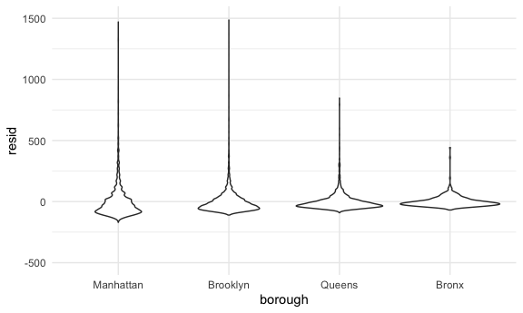

Linear Models
================
11/26/2020

``` r
library(tidyverse)
```

    ## ── Attaching packages ────────────────────────────────────────────────────── tidyverse 1.3.0 ──

    ## ✓ ggplot2 3.3.2     ✓ purrr   0.3.4
    ## ✓ tibble  3.0.3     ✓ dplyr   1.0.2
    ## ✓ tidyr   1.1.2     ✓ stringr 1.4.0
    ## ✓ readr   1.3.1     ✓ forcats 0.5.0

    ## ── Conflicts ───────────────────────────────────────────────────────── tidyverse_conflicts() ──
    ## x dplyr::filter() masks stats::filter()
    ## x dplyr::lag()    masks stats::lag()

``` r
library(patchwork)
library(stringr)
library(p8105.datasets)


knitr::opts_chunk$set(
  fig.width = 6,
  fig.asp = .6,
  out.width = "90%"
)
theme_set(theme_minimal() + theme(legend.position = "bottom"))
options(
  ggplot2.continuous.colour = "viridis",
  ggplot2.continuous.fill = "viridis"
)
scale_colour_discrete = scale_colour_viridis_d
scale_fill_discrete = scale_fill_viridis_d
```

## Data import and tidying

``` r
data("nyc_airbnb")

nyc_airbnb = 
  nyc_airbnb %>% 
  mutate(stars = review_scores_location / 2) %>% 
  rename(
    borough = neighbourhood_group,
    neighborhood = neighbourhood
  ) %>% 
  filter(borough != "Staten Island") %>% 
  select(price, stars, borough, neighborhood, room_type)
```

## Fit a model

Want to know how price of rental is related to stars and borough

``` r
nyc_airbnb %>% 
  ggplot(aes(x = stars, y = price, color = borough)) + 
  geom_point()
```

    ## Warning: Removed 9962 rows containing missing values (geom_point).


Want to fit a model to this

``` r
price_fit = lm(price ~ stars + borough, data = nyc_airbnb)
```

Lets look at model results generically

``` r
price_fit
```

    ## 
    ## Call:
    ## lm(formula = price ~ stars + borough, data = nyc_airbnb)
    ## 
    ## Coefficients:
    ##      (Intercept)             stars   boroughBrooklyn  boroughManhattan  
    ##           -70.41             31.99             40.50             90.25  
    ##    boroughQueens  
    ##            13.21

``` r
#This gives a fair bit of info
summary(price_fit)
```

    ## 
    ## Call:
    ## lm(formula = price ~ stars + borough, data = nyc_airbnb)
    ## 
    ## Residuals:
    ##    Min     1Q Median     3Q    Max 
    ## -169.8  -64.0  -29.0   20.2 9870.0 
    ## 
    ## Coefficients:
    ##                  Estimate Std. Error t value Pr(>|t|)    
    ## (Intercept)       -70.414     14.021  -5.022 5.14e-07 ***
    ## stars              31.990      2.527  12.657  < 2e-16 ***
    ## boroughBrooklyn    40.500      8.559   4.732 2.23e-06 ***
    ## boroughManhattan   90.254      8.567  10.534  < 2e-16 ***
    ## boroughQueens      13.206      9.065   1.457    0.145    
    ## ---
    ## Signif. codes:  0 '***' 0.001 '**' 0.01 '*' 0.05 '.' 0.1 ' ' 1
    ## 
    ## Residual standard error: 181.5 on 30525 degrees of freedom
    ##   (9962 observations deleted due to missingness)
    ## Multiple R-squared:  0.03423,    Adjusted R-squared:  0.03411 
    ## F-statistic: 270.5 on 4 and 30525 DF,  p-value: < 2.2e-16

``` r
#This one give t statistic and p-value for each individual coefficient
summary(price_fit)$coef
```

    ##                   Estimate Std. Error   t value     Pr(>|t|)
    ## (Intercept)      -70.41446  14.020697 -5.022180 5.137589e-07
    ## stars             31.98989   2.527500 12.656733 1.269392e-36
    ## boroughBrooklyn   40.50030   8.558724  4.732049 2.232595e-06
    ## boroughManhattan  90.25393   8.567490 10.534465 6.638618e-26
    ## boroughQueens     13.20617   9.064879  1.456850 1.451682e-01

Tidy results of fit

``` r
broom::glance(price_fit)
```

    ## # A tibble: 1 x 12
    ##   r.squared adj.r.squared sigma statistic   p.value    df  logLik    AIC    BIC
    ##       <dbl>         <dbl> <dbl>     <dbl>     <dbl> <dbl>   <dbl>  <dbl>  <dbl>
    ## 1    0.0342        0.0341  182.      271. 6.73e-229     4 -2.02e5 4.04e5 4.04e5
    ## # … with 3 more variables: deviance <dbl>, df.residual <int>, nobs <int>

``` r
broom::tidy(price_fit)
```

    ## # A tibble: 5 x 5
    ##   term             estimate std.error statistic  p.value
    ##   <chr>               <dbl>     <dbl>     <dbl>    <dbl>
    ## 1 (Intercept)         -70.4     14.0      -5.02 5.14e- 7
    ## 2 stars                32.0      2.53     12.7  1.27e-36
    ## 3 boroughBrooklyn      40.5      8.56      4.73 2.23e- 6
    ## 4 boroughManhattan     90.3      8.57     10.5  6.64e-26
    ## 5 boroughQueens        13.2      9.06      1.46 1.45e- 1

For every one-unit increase in stars, price of room increases by $32
keeping borough fixed. Implicitly ref group is Bronx (first
alphabetical). Room in Manhattan is $90 more than in Bronx.

Get test stat for each and p-value

Queens is not statistically significant

``` r
broom::tidy(price_fit) %>% 
  select(-std.error, -statistic) %>% 
  mutate(
    term = str_replace(term, "borough", "Borough: ")
  ) %>% 
  knitr::kable()
```

| term               |   estimate |   p.value |
| :----------------- | ---------: | --------: |
| (Intercept)        | \-70.41446 | 0.0000005 |
| stars              |   31.98989 | 0.0000000 |
| Borough: Brooklyn  |   40.50030 | 0.0000022 |
| Borough: Manhattan |   90.25393 | 0.0000000 |
| Borough: Queens    |   13.20617 | 0.1451682 |

## Be in control of factors

Character variables get converted to factor variables in R. Preserve
text, but add structure of 1, 2, 3, 4, 5, etc… to it. R makes an
assumption that it should be in alphabetical order, which then gets put
into indicator variables. First one alphabetically will be reference
group

Make ref category the most common one.

``` r
nyc_airbnb =
  nyc_airbnb %>% 
  mutate(
    borough = fct_infreq(borough),
    room_type = fct_infreq(room_type)
  )

nyc_airbnb %>% 
  ggplot(aes(x = stars, y = price, color = borough)) + 
  geom_point()
```

    ## Warning: Removed 9962 rows containing missing values (geom_point).


``` r
price_fit = lm(price ~ stars + borough, data = nyc_airbnb)

broom::tidy(price_fit)
```

    ## # A tibble: 5 x 5
    ##   term            estimate std.error statistic   p.value
    ##   <chr>              <dbl>     <dbl>     <dbl>     <dbl>
    ## 1 (Intercept)         19.8     12.2       1.63 1.04e-  1
    ## 2 stars               32.0      2.53     12.7  1.27e- 36
    ## 3 boroughBrooklyn    -49.8      2.23    -22.3  6.32e-109
    ## 4 boroughQueens      -77.0      3.73    -20.7  2.58e- 94
    ## 5 boroughBronx       -90.3      8.57    -10.5  6.64e- 26

``` r
broom::glance(price_fit)
```

    ## # A tibble: 1 x 12
    ##   r.squared adj.r.squared sigma statistic   p.value    df  logLik    AIC    BIC
    ##       <dbl>         <dbl> <dbl>     <dbl>     <dbl> <dbl>   <dbl>  <dbl>  <dbl>
    ## 1    0.0342        0.0341  182.      271. 6.73e-229     4 -2.02e5 4.04e5 4.04e5
    ## # … with 3 more variables: deviance <dbl>, df.residual <int>, nobs <int>

Now, Brooklyn is being compared to Manhattan, Bronx to Manhattan etc.
This doesn’t change model intrinsically, just changes what you see and
how it works

## Diagnostics

``` r
modelr::add_residuals(nyc_airbnb, price_fit)
```

    ## # A tibble: 40,492 x 6
    ##    price stars borough neighborhood room_type        resid
    ##    <dbl> <dbl> <fct>   <chr>        <fct>            <dbl>
    ##  1    99   5   Bronx   City Island  Private room      9.47
    ##  2   200  NA   Bronx   City Island  Private room     NA   
    ##  3   300  NA   Bronx   City Island  Entire home/apt  NA   
    ##  4   125   5   Bronx   City Island  Entire home/apt  35.5 
    ##  5    69   5   Bronx   City Island  Private room    -20.5 
    ##  6   125   5   Bronx   City Island  Entire home/apt  35.5 
    ##  7    85   5   Bronx   City Island  Entire home/apt  -4.53
    ##  8    39   4.5 Bronx   Allerton     Private room    -34.5 
    ##  9    95   5   Bronx   Allerton     Entire home/apt   5.47
    ## 10   125   4.5 Bronx   Allerton     Entire home/apt  51.5 
    ## # … with 40,482 more rows

This looks like usual df, but shows that for each observation, e.g., the
first room is $9.47 more than expected

``` r
modelr::add_residuals(nyc_airbnb, price_fit) %>% 
  ggplot(aes(x = borough, y = resid)) + 
  geom_violin()
```

    ## Warning: Removed 9962 rows containing non-finite values (stat_ydensity).


This is a distribution of residuals… shows some significnat outliers in
the model

``` r
nyc_airbnb %>% 
  modelr::add_residuals(price_fit) %>% 
  ggplot(aes(x = borough, y = resid)) + 
  geom_violin() + 
  ylim(-500, 1500)
```

    ## Warning: Removed 9993 rows containing non-finite values (stat_ydensity).



``` r
nyc_airbnb %>% 
  modelr::add_residuals(price_fit) %>% 
  ggplot(aes(x = stars, y = resid)) + 
  geom_point() + 
  facet_wrap(. ~borough)
```

    ## Warning: Removed 9962 rows containing missing values (geom_point).


There is a problem in that there are these big outliers in residual
distribution, suggests that model may not be appropriate.

Second plot shows that there are more outliers at higher star ratings
(extremely high priced apartments) that limit how well the model works.

## Hypothesis tests

``` r
price_fit %>% 
  broom::tidy()
```

    ## # A tibble: 5 x 5
    ##   term            estimate std.error statistic   p.value
    ##   <chr>              <dbl>     <dbl>     <dbl>     <dbl>
    ## 1 (Intercept)         19.8     12.2       1.63 1.04e-  1
    ## 2 stars               32.0      2.53     12.7  1.27e- 36
    ## 3 boroughBrooklyn    -49.8      2.23    -22.3  6.32e-109
    ## 4 boroughQueens      -77.0      3.73    -20.7  2.58e- 94
    ## 5 boroughBronx       -90.3      8.57    -10.5  6.64e- 26

This does t-test by default for each coefficient.

What if we want to test the significance of `borough` all together… use
F test (ANOVA)

``` r
fit_null = lm(price ~ stars, data = nyc_airbnb)
fit_alt = lm(price ~ stars + borough, data = nyc_airbnb)

anova(fit_null, fit_alt) %>% 
  broom::tidy()
```

    ## # A tibble: 2 x 6
    ##   res.df         rss    df     sumsq statistic    p.value
    ##    <dbl>       <dbl> <dbl>     <dbl>     <dbl>      <dbl>
    ## 1  30528 1030861841.    NA       NA        NA  NA        
    ## 2  30525 1005601724.     3 25260117.      256.  7.84e-164

If do F-test first, and then do t-test after that then worry about
multiple comparisons corrections being stats problem
